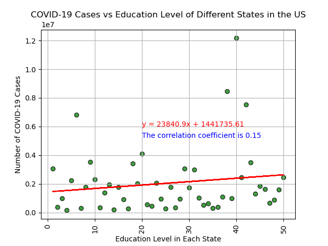
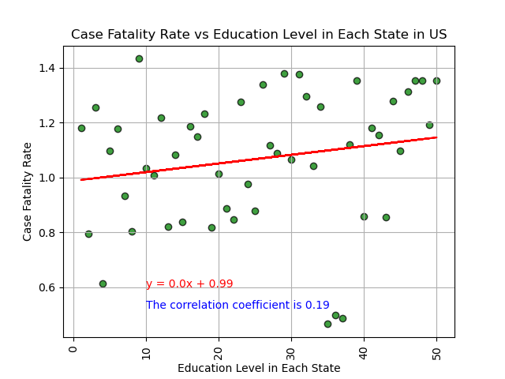
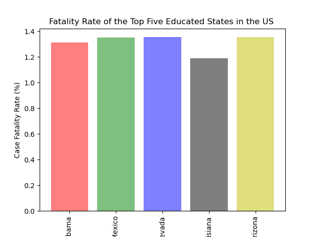
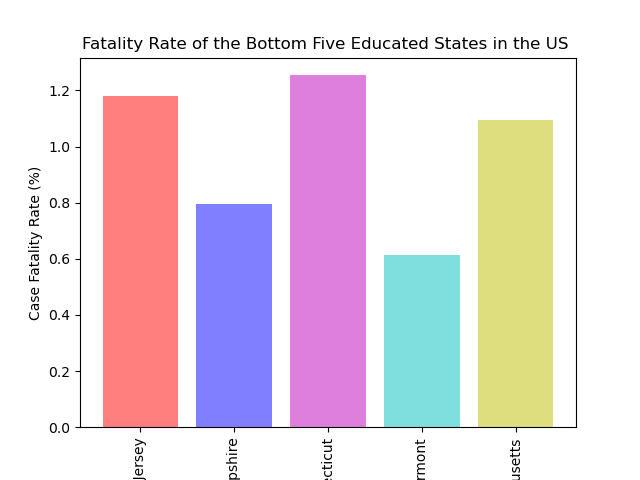

# EDA-project-one-group-one
# Exploratory Data Analysis: COVID-19 and Socioeconomic Status and Comorbidities Across the United States

## Table of Contents
* [Background]()
* [COVID-19 Case Fatality Rate, Poverty Rates, and Average Income in the United States]()
* [COVID-19 Case Fatality Rates and State Education Ranking]()
* [COVID-19 Case Fatality Rates and Underlying Health Conditions]()
* [Citations]()

## Background & Introduction
Socioeconomic status refers to the class of an individual or group and can be categorized based on a combination of education, income, and occupation; all of which tend to go hand-in-hand. It has been shown that groups of lower socioeconomic status are related to reduced access to quality health care [1,2]. Poverty reduces access to healthcare which leads to untreated and worsening conditions that present to hospitals. In the wake of the COVID-19 pandemic, it has become increasingly evident that socioeconomic status plays a significant role in shaping the impact of the virus on communities. The virus has ruthlessly exposed and exacerbated existing inequalities, as individuals from lower socioeconomic backgrounds have been disproportionately affected by higher rates of infection and mortality. Understanding this complex interplay is vital in formulating targeted interventions and policies that can pave the way towards a more equitable and resilient response to future public health challenges.

The questions that are answered about the topic are:
Q1: Do areas of lower income tend to have higher case fatality rates than that of higher income areas?
Q2: Do states with a lower average education ranking have a higher case fatality rate?
Q3: What is the comorbidity that leads to the highest case fatality rate when coupled with COVID-19 infection?

## COVID-19 Case Fatality Rate, Poverty Rates, and Average Income
The repository related to this topic uses the following files:
* [Analysis by State.ipynb](): data analysis performed at the State level.
* [Analysis by County.ipynb](): data analysis performed at the County level.
* [averageIncome_2021.csv](): data exported from the Analysis by State jupyter notebook to allow for manual modification of the average income custom dataset.
* [averageIncome_2021_adjusted.csv](): the result of the manually adjusted average income csv file to use in the Analysis by State and Analysis by County jupyter notebook files.
* [state_abbrevs.py](): a supporting python file containing the US State abbreviations as a dictionary which is used in both jupyter notebook files.
* [us-counties-2021.csv](): COVID-19 data from 2021 used to merge with the different datasets to use in the analysis and to calculate the case fatality rate (CFR).

### Datasets
In order to answer the question of if areas in the United States (US) of lower socioeconomic status are more likely to experience higher numbers of COVID-19 cases and deaths, three datasets were used:
* Median Income by County in the US: https://apps.bea.gov/api/_pdf/bea_web_service_api_user_guide.pdf
* US County Population: https://www.census.gov/data/tables/time-series/demo/popest/2020s-counties-total.html
* COVID-19 Data in the US: https://github.com/nytimes/covid-19-data

The reason behind going as granular with the data from US Counties instead of States is largely due to the fact that States in America have a large social gradient because there are areas within States that are rich, and others that have people living in poverty. 

### Analysis
The average Income (USD) and Case Fatality Rates (%) of US Counties were explored. Using the merged data frames, the case fatality rate in each county was calculated by dividing the number of deaths in the County by the number of cases in the County using the data from the end of 2021. The reason behind using that particular date is because we are looking at a snapshot in time and the data frame provides the cumulative number of cases. The County data was then sorted by case fatality rate and separately by the average income in each state to produce the following four bar graphs.

The expectation was that counties with higher average income would have a lower case fatality rate. The bar plots do not show a definitive relationship. As a result, the data was further explored by looking at the relationship between County and State Average Income (USD) and CFR (%). Outliers were removed from both the County and State level data frames and plotted on a scatter plot to visualize the distribution of data. 

The correlation values for the above two graphs were both very weak: -0.25 for County and -0.18 for State. Taking a deeper look at the State scatter plot, the data is clustered almost like a U shape which inspired the next step of the analysis which was to split the average income data for each State into two groups based on whether they fall below the median income or above the median income. The median income was calculated to be around USD$55k.

T-testing: A T-test was performed for to check if the mean income of two different income groups were different from each other. The results gave a pvalue of 2.2347e-11 which meant we could reject the null hypothesis and that the means from the two groups were different enough. The data was split into the two groups used for T-testing by finding the median income across all of the States in the dataframe. The data was visualized using a scatterplot containing a regression analysis.

The results of these two graphs are interesting and show that areas below the median income have a moderate negative association with poverty rate and CFR. There is a weak positive association with average income higher than the median income in the US and CFR, however, because of the low R^2 value, the distribution of this relationship around the linear regression may not be significant.

The relationship between poverty rate and CFR was also analyzed. Based on the graph below, there is a weak positive correlation between the poverty rate of states in the US and the case fatality rate.

### Summary, Limitations, & Next Steps
Two metrics were analyzed against the case fatality rate of COVID-19 in the US: (1) Average Household Income, and (2) Poverty Rate. The following are observations from the data analysis:
* Average household income in the states seems to play a larger role on COVID-19 CFR when areas are below the median household income in the US based on the dataset that was analyzed.
* The CFR for States in the US with average household incomes greater than the median household income did not show a significant relationship.
* The general trendline for poverty rate vs the CFR for the States in the US shows a weak positive correlation.

A few limitations of the dataset were identified:
* Datasets were analyzed mainly at the State level: not granular enough to capture the social gradient between the upper and lower classes in each State.
* With respect to the median income and poverty rates against COVID-19, the data only looks at a snapshot in time, and does not consider the changing nature of reactions to the pandemic (non-pharmaceutical interventions).
* The only metric used to analyze the impact of COVID-19 on different areas was the case fatality rate. Another metric to consider would be hospitalization rates as they may tell more about the impact of the virus in certain areas.
* The COVID-19 case fatality rate does not represent the full impact of COVID-19. Deaths related to other health conditions are not considered in the analysis and may tell a different story.

To uncover more about the dataset keeping in mind the limitations of this analysis, some ideas for further analysis next steps are highlighted below:
* Analyze the same information by zip code and see if the results are more what the team expected.
* Look more at population density distributions against case fatality rate.
* Hospital ranking.
* Look at the relationship between average quality of healthcare and population density against COVID-19 metrics.

## COVID-19 Case Fatality Rates and State Education Ranking
The COVID-19 pandemic has had an unprecedented impact on global health and economies, revealing complex relationships between various factors and the spread of the virus. One such factor that demands investigation is the role of education rank in influencing COVID-19 incidence rates. This study aims to explore the potential connection between education rank and the prevalence of COVID-19 cases, drawing from diverse data sources and statistical analyses.

### Datasets
In order to answer the question of the role of education rank in influencing COVID-19 incidence rates, three datasets were used:
* COVID-19 Data in the US: https://github.com/nytimes/covid-19-data
* https://nces.ed.gov/pubs2018/2018052/tables/table_02.asp
* https://wallethub.com/edu/e/states-with-the-best-schools/5335

Data was taken from all these sources in the form of CSV files to the Jupyter Notebook. In order to get the main dataset we need for my study, the data was cleaned merged into one data frame. Below are a few activities that were performed to achieve the final data frame that was used for analysis:
* Accessing the data
* Reducing the number of columns
* Renaming the datasets
* Dropping the empty data
* Merging the two data sets into a data frame

A few scatter plots and bar plots were created in python to help visualize the data.

To understand the relation between education level and number of covid cases in each state, the above scatter plot was generated and the correlation coefficient was calculated. R value is smaller than 0.3, meaning the relation between number of COVID-19 cases and the education level in each State is very weak. 

In order to understand the data of education level and case fatality, the above scatter plot was created and the value was calculated. Unfortunately, r value is lower than 0.3, that means the relation between these two variables is very weak. 

Bar plots were created to show the number of deaths in the top five educated states and the bottom five educated states. These two bars help find if the best educated state has the lowest fatality rate, and if the worst educated state has the highest fatality rate. 

Based on the bar graph, the top five educated states actually had higher case fatality rates than the lowest educated states, which was the opposite finding to our expectation. It would be interesting to look at the data for population of each of the schools in the states at a more granular level.

### Summary, Conclusions, Next Steps

Several hypotheses could explain the potential relationship between education rank and COVID-19 incidence rates. Higher-ranked education systems may lead to better public health awareness, increased compliance with preventive measures, and more effective communication strategies during the pandemic. Conversely, regions with lower education ranks might face challenges in disseminating accurate information and implementing successful containment strategies.

Understanding the connection between education rank and COVID-19 incidence rates can have significant implications for policymakers. If a positive relationship is found, it could underscore the importance of investing in education and public health initiatives to combat future health crises effectively. Conversely, a negative relationship may highlight the need for targeted interventions in regions with lower-ranked education systems.

This study's findings aim to shed light on the potential relationship between education rank and COVID-19 incidence rates, contributing to the growing body of knowledge about the multifaceted impact of the pandemic. It is hoped that the insights gained will aid policymakers in formulating evidence-based strategies to mitigate the impact of future pandemics and improve overall public health outcomes.

This study showed a weak relationship between education rank and COVID-19 incidence rates, contributing to the growing body of knowledge about the multifaceted impact of the pandemic.

## COVID-19 Case Fatality Rates and Underlying Health Conditions

### Datasets
Three datasets were used in this analysis:
* Covid-19 Data(Includes current Active cases, Deaths,Recovery)
* Covid-19 Vaccination data (Vaccine numbers, Fully Vaccinated)
* Covid-19 deaths with underlying diseases (What underlying diseases cost most deaths In Covid-19)

The first dataset was used to answer the following questions:
* Which states are more affected by active cases,Covid Deaths?
* Which State are least affected by active cases,Covid Deaths?
* Which States are most covid recovery states?

### Active Case percentage per States(Most and Least)
A bar chart was created to show the most affected State with active cases.

The most percentage of active cases are: Rhode Island, Alaska, Kentucky, North Dakota and New Virginia. The least percentage of active cases are: Maryland, Oregon, Maine, Vermont, Washington

### Most and least affected Covid-19 Death percentage per States
The most affected, least affected and most recovery rates per states

Most death rates Top 5: Pennsylvania, Georgia, Mississippi, Michigan, Arizona. Least Death rates 5 states: Hawaii, Utah, Alaska, Vermont, New hampshire. Recovery Rate 5 states: Alaska, North Dakota, Utah, West Virginia, Montana.

### Vaccinations Dataset
Question to answer: What is the vaccine number for 5,000,000 people to be fully vaccinated?
The dataset was processed to calculate the total number of vaccinations and fully vaccinated people. The goal of Run a linear regression on the data to predict the answer.

Based on the regression line, the total number of vaccines needed to achieve a total vaccination of 5 million individuals is 12,329,140 vaccines.

### Underlying Diseases
Questions to answer: Q1. Which age group is most affected by covid 19? Q2. Which patients are at high and low risk for covid-19 deaths?

The data was analyzed to determine the highest risk and lowest risk patients infected with COVID-19 based on their comorbidities. The bar plots below show the results. The most high-risk comorbidities to have when infected with COVID-19 are Influenza and pneumonia, Respiratory Failure, Hypertensive diseases, Diabetes, and Cardiac Arrest. While the least risky are patients with Respiratory arrest, injury-poisoning, alzheimer, obesity, other respiratory diseases.

### Summary of Results and Findings
* Most covid active cases percentage are in Rhode Island, Alaska, Kentucky, North Dakota and New Virginia states.
* The least percentage of active cases are: Maryland, Oregon, Maine, Vermont, Washington.
* The most recovered states are Alaska, North Dakota, Utah, West Virginia, Montana.
* The total number of vaccines required to distibute to the population in order to achieve 5 million fully vaccinated people is 12,329,140.
* Highly risky patients prone to death is  Influenza and pneumonia, Respiratory Failure, Hypertensive diseases, Diabetes, Cardiac Arrest

## Citations
[https://apps.bea.gov/api/_pdf/bea_web_service_api_user_guide.pdf](https://apps.bea.gov/api/_pdf/bea_web_service_api_user_guide.pdf)
[https://www.census.gov/data/tables/time-series/demo/popest/2020s-counties-total.html](https://www.census.gov/data/tables/time-series/demo/popest/2020s-counties-total.html)
[https://github.com/nytimes/covid-19-data](https://github.com/nytimes/covid-19-data)
[https://thefactfile.org/us-states-counties/](https://thefactfile.org/us-states-counties/)
[https://gist.github.com/rogerallen/158359](https://gist.github.com/rogerallen/158359)
[https://journals.lww.com/academicmedicine/fulltext/2004/12000/health_disparities_based_on_socioeconomic.4.aspx](https://journals.lww.com/academicmedicine/fulltext/2004/12000/health_disparities_based_on_socioeconomic.4.aspx)
[https://www.ncbi.nlm.nih.gov/pmc/articles/PMC7314918/](https://www.ncbi.nlm.nih.gov/pmc/articles/PMC7314918/)
[https://wallethub.com/edu/e/states-with-the-best-schools/5335](https://wallethub.com/edu/e/states-with-the-best-schools/5335)
[https://nces.ed.gov/pubs2018/2018052/tables/table_02.asp](https://nces.ed.gov/pubs2018/2018052/tables/table_02.asp)
[https://data.cdc.gov/NCHS/Conditions-Contributing-to-COVID-19-Deaths-by-Stat/hk9y-quqm](https://data.cdc.gov/NCHS/Conditions-Contributing-to-COVID-19-Deaths-by-Stat/hk9y-quqm)
[https://www.kaggle.com/datasets/paultimothymooney/usa-covid19-vaccinations](https://www.kaggle.com/datasets/paultimothymooney/usa-covid19-vaccinations)
[https://www.kaggle.com/discussions/general/246407](https://www.kaggle.com/discussions/general/246407)
